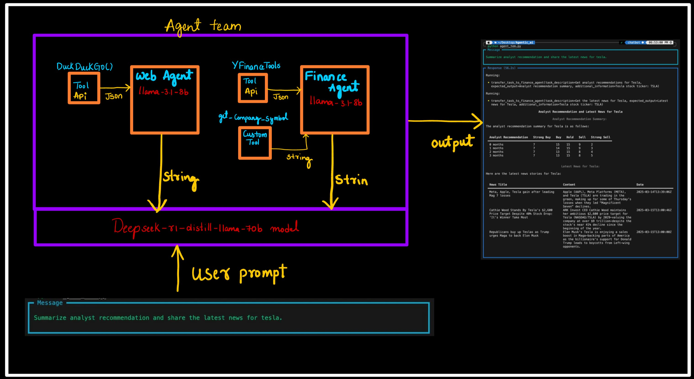
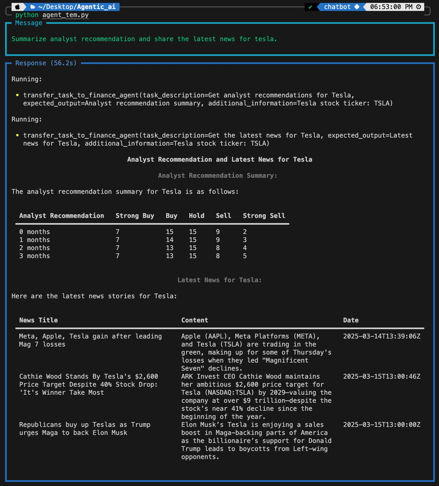

# Agentic-Ai

# Work Flow


Agentic AI solution designed to build a Finance Chatbot using the Phidata framework and open-source LLMs deployed on Groq. The chatbot leverages tools like DuckDuckGo for web search and YFinance for real-time financial data. It uses multiple agents, including a Web Agent for fetching up-to-date information and a Finance Agent for retrieving stock market insights, analyst recommendations, and financial news. 
Models: llama-3.1-8b-instan with CONTEXT WINDOW - 128K and deepseek-r1-distill-llama-70b with CONTEXT WINDOW - 128K.

# Steps 
  ## Step 1: setup the environment 💻
```bash
git clone https://github.com/Abhijit7979/Agentic-Ai.git
conda env create -f env.yml  
conda activate AgenticAI  
```
  ##  Step 1.2: setup the API keys 💻
  create .env file add Api keys of phidata , groq, openai
```bash
GROQ_API_KEY="API_key"
PHI_API_KEY ="API_ke"
OPENAI_API_KEY="API_ke"
```

  ##  Step 2: navigate to Agent_team.py 🏃‍♂️
```bash
cd Agentic-Ai/src
python Agent_team.py
```
##  Step 3:  give user prompt 




# Tools (phi data) 
- YFinanceTools enable an Agent to access stock data, financial information and more from Yahoo Finance.

## we have build 2 other agents 
- Data analyst :   
